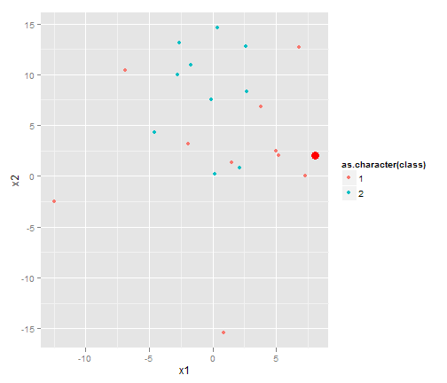

第11周 数据分析与R语言  -- 张丹(24)
========================================================

书面作业 
1-2 薛毅书P557，9.3，9.4(1) 

互动作业 
本周的互动仍以算法和R语言实现为主。 
要求每位同学至少发2篇主题，就算法理论以及在R上的有
关用法进行探讨。发到R中国用户组或数据分析与数据挖掘版。 
另外要求每位同学至少参与5个上述主题的讨论（回帖）。

## 9.3


```r
x<- c(1.000, 0.846, 0.805, 0.859, 0.473, 0.398, 0.301, 0.382,
      0.846, 1.000, 0.881, 0.826, 0.376, 0.326, 0.277, 0.277, 
      0.805, 0.881, 1.000, 0.801, 0.380, 0.319, 0.237, 0.345, 
      0.859, 0.826, 0.801, 1.000, 0.436, 0.329, 0.327, 0.365, 
      0.473, 0.376, 0.380, 0.436, 1.000, 0.762, 0.730, 0.629, 
      0.398, 0.326, 0.319, 0.329, 0.762, 1.000, 0.583, 0.577, 
      0.301, 0.277, 0.237, 0.327, 0.730, 0.583, 1.000, 0.539, 
      0.382, 0.415, 0.345, 0.365, 0.629, 0.577, 0.539, 1.000)
names<-c("x1", "x2", "x3", "x4", "x5", "x6", "x7", "x8")
# names<=c("身高","手臂长","上肢长","下肢长","体重","颈围","胸围","胸宽")
R<-matrix(x, nrow=8, dimnames=list(names, names))
```


### 方法一：使用factanal的极大似然法，对2个因子进行分析。
factor1的"身高","手臂长","上肢长","下肢长"是趋近于1的，这些描述是身高特征。
factor2的"体重"是趋近于1的，描述了体重的特征。


```r
fa2 <- factanal(factors = 2, covmat = R)
fa2
```

```
## 
## Call:
## factanal(factors = 2, covmat = R)
## 
## Uniquenesses:
##    x1    x2    x3    x4    x5    x6    x7    x8 
## 0.166 0.110 0.166 0.196 0.099 0.360 0.414 0.538 
## 
## Loadings:
##    Factor1 Factor2
## x1 0.869   0.282  
## x2 0.929   0.164  
## x3 0.896   0.174  
## x4 0.862   0.247  
## x5 0.244   0.917  
## x6 0.201   0.774  
## x7 0.141   0.752  
## x8 0.222   0.643  
## 
##                Factor1 Factor2
## SS loadings      3.333   2.618
## Proportion Var   0.417   0.327
## Cumulative Var   0.417   0.744
## 
## The degrees of freedom for the model is 13 and the fit was 0.2495 
```


### 方法二：使用书中的主成法，对2个因子进行分析。
factor1的"身高","手臂长","上肢长","下肢长"是趋近于1的，这些描述是<b>身高</b>特征。
factor2的"体重","颈围","胸围","胸宽"是比较大，描述了<b>体重</b>的特征。


```r
source("factor.analy.R")
fa <- factor.analy(R, m = 2, method = "princomp")
vm <- varimax(fa$loadings, normalize = FALSE)
vm
```

```
## $loadings
## 
## Loadings:
##    Factor1 Factor2
## X1 -0.913   0.232 
## X2 -0.939   0.168 
## X3 -0.929   0.136 
## X4 -0.911   0.201 
## X5 -0.282   0.871 
## X6 -0.210   0.827 
## X7 -0.137   0.828 
## X8 -0.227   0.754 
## 
##                Factor1 Factor2
## SS loadings      3.603   2.839
## Proportion Var   0.450   0.355
## Cumulative Var   0.450   0.805
## 
## $rotmat
##        [,1]    [,2]
## [1,] 0.7888 -0.6146
## [2,] 0.6146  0.7888
## 
```


### 方法三：使用psych包的fa方法，主成法


```r
library(psych)
```

```
## Warning: package 'psych' was built under R version 2.15.1
```

```r
fa <- fa(R, nfactors = 2, rotate = "varimax", fm = "pa")
```

```
## Loading required package: MASS
```

```
## Warning: package 'MASS' was built under R version 2.15.1
```

```
## Loading required package: GPArotation
```

```r
fa
```

```
## Factor Analysis using method =  pa
## Call: fa(r = R, nfactors = 2, rotate = "varimax", fm = "pa")
## Standardized loadings (pattern matrix) based upon correlation matrix
##     PA1  PA2   h2   u2
## x1 0.88 0.27 0.84 0.16
## x2 0.93 0.16 0.88 0.12
## x3 0.89 0.18 0.82 0.18
## x4 0.87 0.24 0.81 0.19
## x5 0.25 0.91 0.88 0.12
## x6 0.20 0.77 0.64 0.36
## x7 0.14 0.75 0.58 0.42
## x8 0.22 0.66 0.49 0.51
## 
##                 PA1  PA2
## SS loadings    3.34 2.62
## Proportion Var 0.42 0.33
## Cumulative Var 0.42 0.74
## 
## Test of the hypothesis that 2 factors are sufficient.
## 
## The degrees of freedom for the null model are  28  and the objective function was  6.83
## The degrees of freedom for the model are 13  and the objective function was  0.15 
## 
## The root mean square of the residuals (RMSR) is  0.02 
## The df corrected root mean square of the residuals is  0.03 
## 
## Fit based upon off diagonal values = 1
## Measures of factor score adequacy             
##                                                 PA1  PA2
## Correlation of scores with factors             0.97 0.95
## Multiple R square of scores with factors       0.94 0.91
## Minimum correlation of possible factor scores  0.89 0.81
```

```r
factor.plot(fa, labels = rownames(fa$loadings))
```

 

### 三种方法结果类似！！使用psych包，更灵活一些。

## 9.4(1)


```r
dat = read.table(textConnection("X1  X2  X3  X4  X5\n1  99  94  93 100 100\n2  99  88  96  99  97\n3 100  98  81  96 100\n4  93  88  88  99  96\n5 100  91  72  96  78\n6  90  78  82  75  97\n7  75  73  88  97  89\n8  93  84  83  68  88\n9  87  73  60  76  84\n10  95  82  90  62  39\n11  76  72  43  67  78\n12  85  75  50  34  37"), 
    header = TRUE)

# names<=c('政治','语文','外语','数学','物理')
```


### 使用factanal的极大似然法，对2个因子进行分析。
factor1的"政治","语文"是趋近于1的，这些描述是 <b>文科</b> 特征。
factor2的"数学","物理"是趋近于1的，这些描述是 <b>理科</b> 特征。


```r
fa <- factanal(~., factors = 2, data = dat)
fa
```

```
## 
## Call:
## factanal(x = ~., factors = 2, data = dat)
## 
## Uniquenesses:
##    X1    X2    X3    X4    X5 
## 0.005 0.141 0.494 0.005 0.346 
## 
## Loadings:
##    Factor1 Factor2
## X1 0.992   0.104  
## X2 0.854   0.360  
## X3 0.497   0.509  
## X4 0.284   0.956  
## X5 0.132   0.798  
## 
##                Factor1 Factor2
## SS loadings      2.059   1.950
## Proportion Var   0.412   0.390
## Cumulative Var   0.412   0.802
## 
## Test of the hypothesis that 2 factors are sufficient.
## The chi square statistic is 0.28 on 1 degree of freedom.
## The p-value is 0.598 
```


