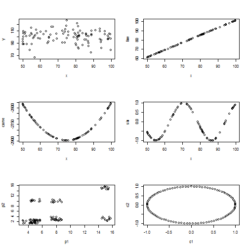

分析大型数据集内的趋势--对6种内集的测试
========================================================

参考Science的一篇文章
Detecting Novel Associations in Large Data Sets

## 构造数据集，如下图显示


```r
par(mfrow = c(3, 2))
x <- runif(100, max = 100, min = 50)
y <- rnorm(100, mean = 100, sd = 10)
plot(x, y)

line <- 0.8 * x + 21
plot(x, line)

curve <- 0.534 * x^2 - 80 * x + 100
plot(x, curve)

sin <- sin(x/5)
plot(x, sin)

p1 = jitter(c(rep(4, 10), rep(5, 40), rep(8, 30), rep(15, 20)), factor = 4)
p2 = jitter(c(rep(2, 40), rep(10, 20), rep(3, 30), rep(15, 10)), 
    factor = 4)
plot(p1, p2)

z = seq(0, 2 * pi, length = 100)
c1 = sin(z)
c2 = cos(z)
plot(c1, c2)
```

 


### 输出数据到文件


```r
data <- data.frame(x = x, y = y, line = line, curve = curve, sin = sin, 
    p1 = p1, p2 = p2, c1 = c1, c2 = c2)
write.table(data, file = "relation.csv", col.names = TRUE, row.names = FALSE, 
    quote = FALSE, sep = ",")
```


### 产生分析结果


```r
source("MINE.r")
MINE("relation.csv", "all.pairs", 0)
```

```
## **********************************************************
## MINE version 1.0.1d
## Copyright 2011 by David Reshef and Yakir Reshef.
## 
## This application is licensed under a Creative Commons
## Attribution-NonCommercial-NoDerivs 3.0 Unported License.
## See
## http://creativecommons.org/licenses/by-nc-nd/3.0/ for
## more information.
## **********************************************************
## 
## 
## input file = relation.csv
## analysis style = allpairs
## results file name = 'relation.csv,allpairs,cv=0.0,B=n^0.6,Results.csv'
## print status frequency = every 100 variable pairs
## status file name = 'relation.csv,allpairs,cv=0.0,B=n^0.6,Status.txt'
## alpha = 0.6
## numClumpsFactor = 15.0
## debug level = 0
## required common values fraction = 0.0
## garbage collection forced every 2147483647 variable pairs
## reading in dataset...
## done.
## Analyzing...
## 1 calculating: y vs x...
## 36 variable pairs analyzed.
## Sorting results in descending order...
## done. printing results
## Analysis finished. See file "relation.csv,allpairs,cv=0.0,B=n^0.6,Results.csv" for output
```


### 对结果数据进行抓图


#### x,y为线性情况：MIC=1，是强关联
#### x,y为曲线情况：MIC=1，是强关联
#### x,y为正弦情况：MIC=1，是强关联
#### x,y为噪点情况：MIC=0.68，是强关联
#### x,y为圆形情况：MIC=0.63，是强关联
#### x,y为随机情况：MIC=0.37，无关联


